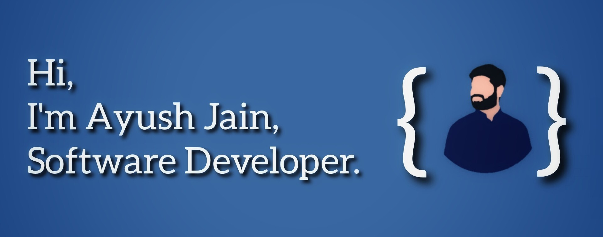

<!--  -->
<!--  -->

# 👋 Hi there, I'm Ayush Jain, a Software Developer!

I'm a passionate software developer with a penchant for architecting solutions using various platforms for scalable deployments, real-time data handling, and application development. Throughout my journey in development, I've honed my skills in version control mastery with tools like GitHub, embraced robust project management via modern platforms, and found comfort in command-line wizardry on different operating systems.

## 🚀 My Toolbox:

### Languages:

<code></code>
<code></code>
<code></code>
<code></code>
<code></code>
<code></code>
<code></code>
<code></code>

### Technologies and Tools Stack:

**Mobile & Web Development:**

<code></code>
<code></code>
<code></code>

**Cloud Services:**

<code></code>
<code></code>
<code></code></code>

**Version Control & Project Management**

<code></code>
<code></code>
<code></code>

**Automation & Productivity:**

<code></code>
<code></code>
<code></code>
<code></code>

> 🌟 I thrive on challenges and believe in crafting elegant solutions to complex problems. From mobile and web apps to scalable cloud solutions, I enjoy every step of the development process, constantly learning and evolving.

---
<!--
 

---
-->
**📫 Let's connect and explore the endless possibilities of tech together! Reach out at**

 

